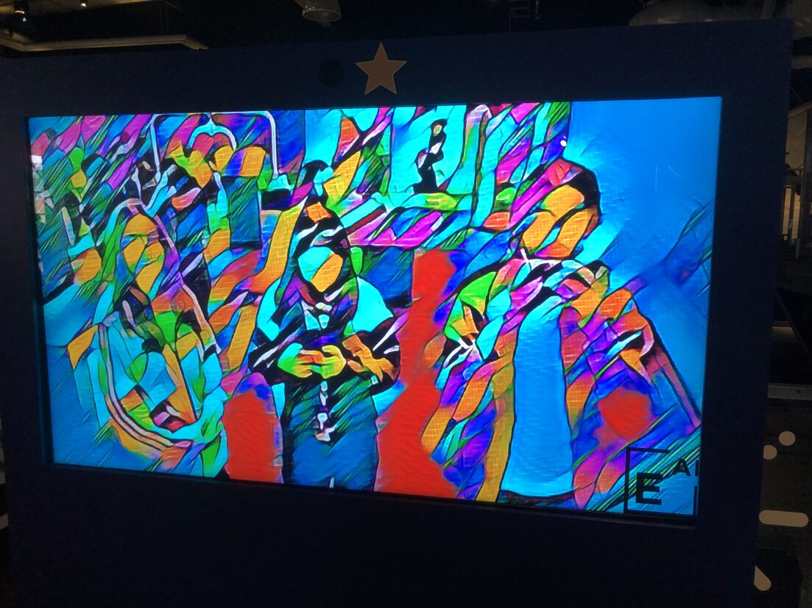
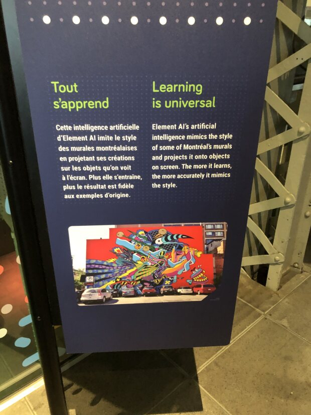
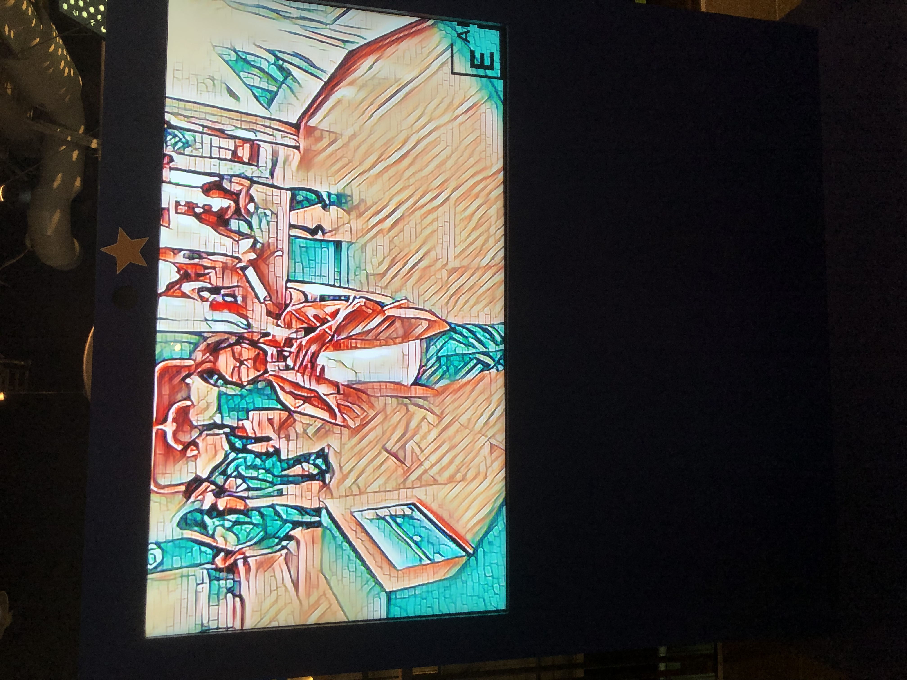
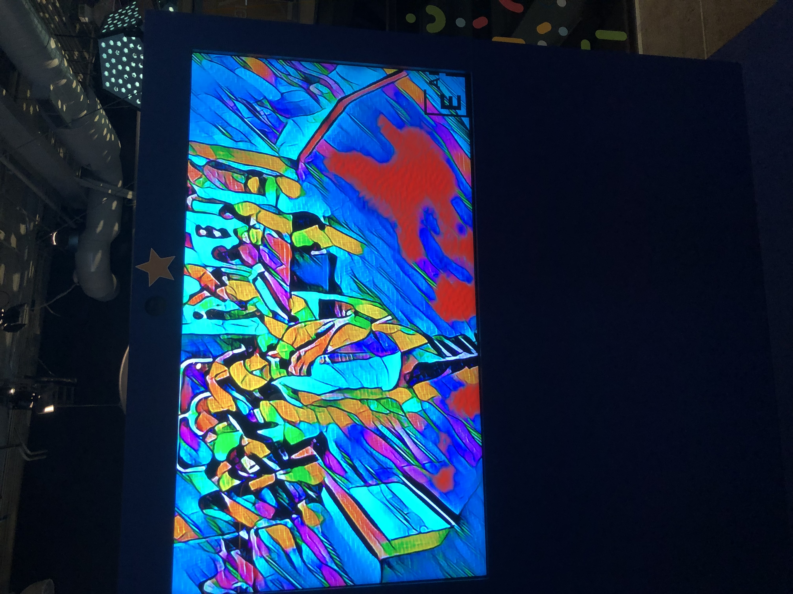
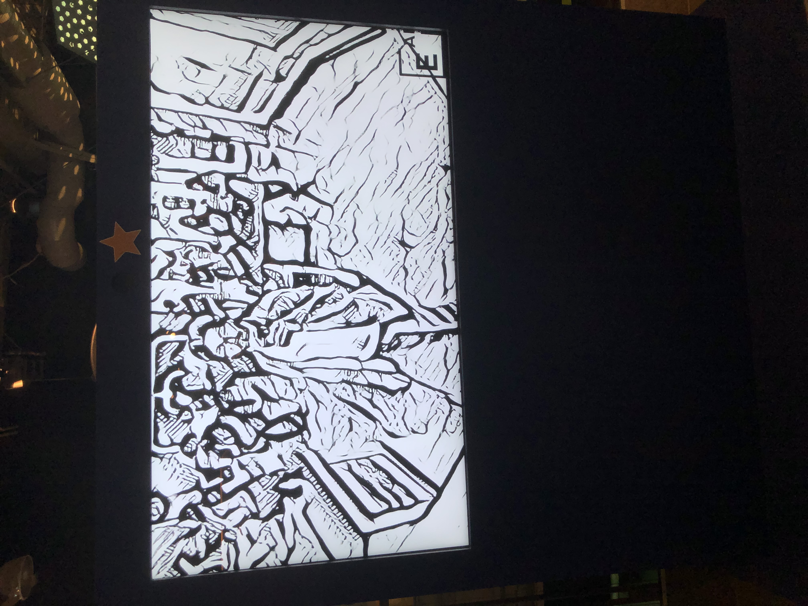
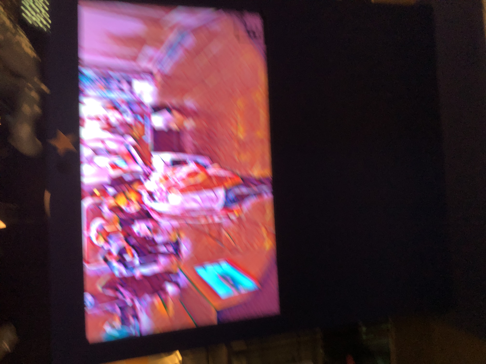

# Centre des sciences de Montréal : Présentation et expérimentation d'une oeuvre interactive

 

## Informations essentielles

- **Type d'exposition** : Intérieure
  
- **Date de visite** : Mercredi, le 10 avril 2024
  
- **Titre de l'oeuvre** : Tout s'apprend
        
- **Artiste(s)/Firme(s)** :
  
 
 
 
- **Année de réalisation** : N/A
  
- **Type d'installation** : Interactive

 

## Description de l'oeuvre et son contenu

*Tout s'apprend* est un dispositif qui explore diverses formes d'art mural dont la clarté et la réciprocité aux styles originaux s'amplifient dépendamment du niveau d'entraînement cérébral du système d'intelligence artificielle inclu dans l'installation.

Pour une description plus complète, consulter l'image ci-dessous :

 

## Mise en espace & fonctionnement de l'oeuvre

C'est un dispositif assez simple à utiliser. Les visiteurs sont exposés à un écran large sur lequel on peut se regarder sous différents filtres artistiques. Il est d'ailleurs permis d'interagir avec le panneau d'options situé à la gauche afin de non seulement alterner entre un style, puis l'autre ,mais, aussi, de modifier l'intensité de l'esthétique. La procédure consiste à, respectivement, appuyer sur la forme que l'on préfère, et déplacer le cerveau numérique visible sur le panneau afin de graduellement se rapprocher du style original.

Pour un aperçu du fonctionnement, consulter le lien ci-dessous :

[Fonctionnement - Tout s'apprend](https://cmontmorency365-my.sharepoint.com/:v:/g/personal/2148323_cmontmorency_qc_ca/EeKVCX6vHsBMk2RY9K67ZRABK_HwXe4PxJ8dQBrsK1kofw?nav=eyJyZWZlcnJhbEluZm8iOnsicmVmZXJyYWxBcHAiOiJTdHJlYW1XZWJBcHAiLCJyZWZlcnJhbFZpZXciOiJTaGFyZURpYWxvZy1MaW5rIiwicmVmZXJyYWxBcHBQbGF0Zm9ybSI6IldlYiIsInJlZmVycmFsTW9kZSI6InZpZXcifX0%3D&e=3EyN9c)

Pour un aperçu des formes artistiques variées, voir les images ci-dessous : 

 
 
 
 

## Composantes et techniques

## Expérience vécue

## Points positifs

## Aspects que je changerais

