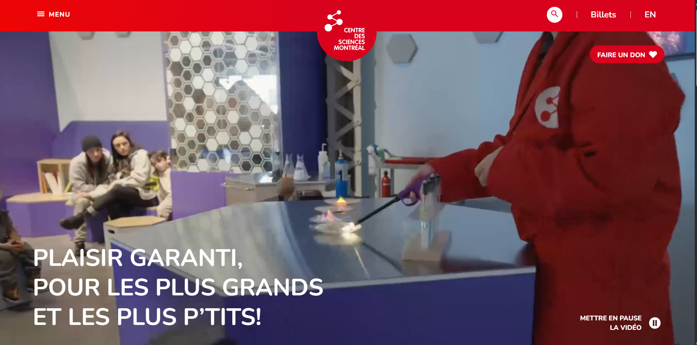

# Centre des sciences de Montréal : Présentation et expérimentation d'une oeuvre interactive

 

## Informations essentielles

- **Type d'exposition** : Intérieure
  
- **Date de visite** : Mercredi, le 10 avril 2024
  
- **Titre de l'oeuvre** : Tout s'apprend
        
- **Artiste(s)/Firme(s)** :
  
 
 
 
- **Année de réalisation** : N/A
  
- **Type d'installation** : Interactive

 

## Description de l'oeuvre et son contenu

*Tout s'apprend* est un dispositif qui explore diverses formes d'art mural dont la clarté et la réciprocité aux styles originaux s'amplifient dépendamment du niveau d'entraînement cérébral du système d'intelligence artificielle inclu dans l'installation.

Pour une description plus complète, consulter l'image ci-dessous :

 

## Mise en espace & fonctionnement de l'oeuvre

C'est un dispositif assez simple à utiliser. Les visiteurs sont exposés à un écran large sur lequel on peut se regarder sous différents filtres artistiques. Il est d'ailleurs permis d'interagir avec le panneau d'options situé à la gauche afin de non seulement alterner entre un style, puis l'autre ,mais, aussi, de modifier l'intensité de l'esthétique. La procédure consiste à, respectivement, appuyer sur la forme que l'on préfère, et déplacer le cerveau numérique visible sur le panneau afin de graduellement se rapprocher du style original.

Pour un aperçu du fonctionnement, consulter le lien ci-dessous :

[Fonctionnement - Tout s'apprend](https://cmontmorency365-my.sharepoint.com/:v:/g/personal/2148323_cmontmorency_qc_ca/EeKVCX6vHsBMk2RY9K67ZRABK_HwXe4PxJ8dQBrsK1kofw?nav=eyJyZWZlcnJhbEluZm8iOnsicmVmZXJyYWxBcHAiOiJTdHJlYW1XZWJBcHAiLCJyZWZlcnJhbFZpZXciOiJTaGFyZURpYWxvZy1MaW5rIiwicmVmZXJyYWxBcHBQbGF0Zm9ybSI6IldlYiIsInJlZmVycmFsTW9kZSI6InZpZXcifX0%3D&e=3EyN9c)

Pour un aperçu des formes artistiques variées, voir les images ci-dessous : 

 
 
 
 

## Composantes et techniques

- Écran large pour que l'interacteur puisse se regarder
- Petit écran pour le panneau d'options
- Boutons numériques du panneau interactif
- Système d'intelligence artificielle
- Filtres (styles artistiques)

 

## Expérience vécue

Tel que décrit plus haut, *Tout s'apprend* offre une interaction loin de la complexité. Il suffit juste que les visiteurs manipulent les paramètres du panneau interactif afin de personnaliser la projection sur en grand écran. En ce qui me concerne, j'ai trouvé ça fascinant. Je joue parfois avec les filtres disponibles sur Snapchat, et on y trouve souvent des effets surprenants (distortion de visage, traits bestiaux et ainsi de suite). *Tout s'apprend* est très similaire à mon avis, car on constate à quel point l'art peut engendrer de nombreuses découvertes, ce qui, conséquemment, permet d'expandre sa conception du domaine de la création.

## Points positifs

J'ai un faible pour l'invention de personnages, et je me contente généralement de m'inspirer des références historiques (les vieux modes vestimentaires par exemple) pour réaliser un projet dans ce domaine. En considérant les différents styles de *Tout s'apprend*, je songe peut-être à essayer de nouvelles méthodes pour mes dessins numériques.

## Aspects que je changerais

L'oeuvre en soi était passionnante, mais je pense qu'elle pourrait attirer une plus grande audience en intégrant d'autres formes d'art dans son contenu. Par exemple, on pourrait ajouter un filtre d'animation japonaise pour voir à quoi on ressemblerait dans un dessin animé.

