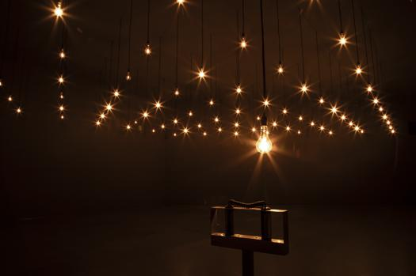
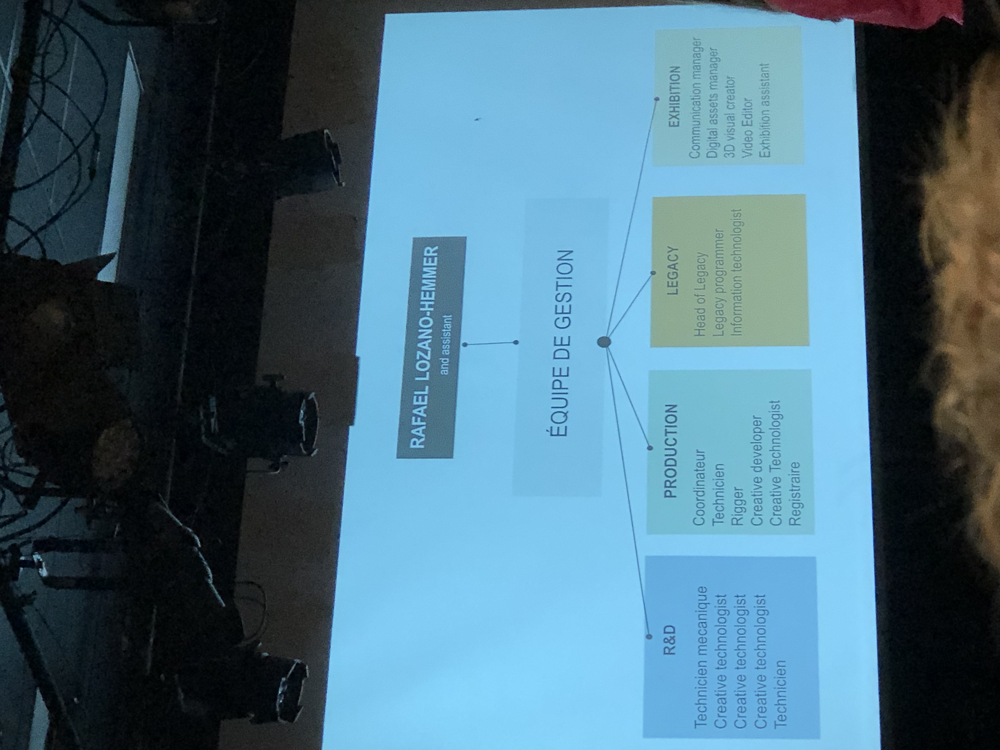
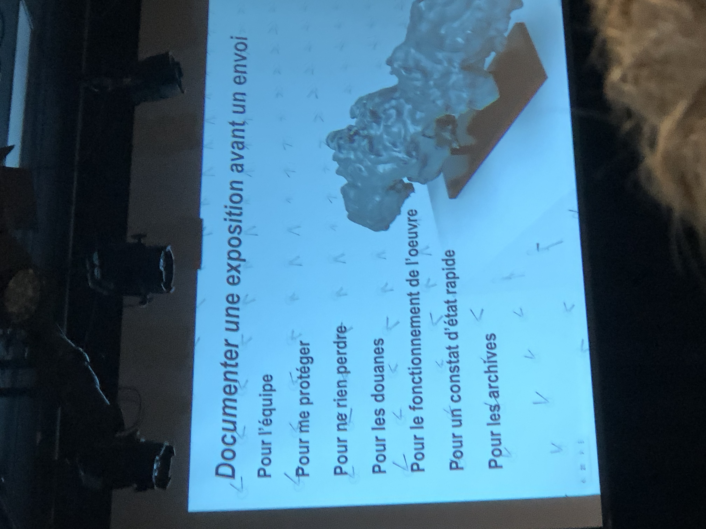

# Conférence : Studio Antimodular

 

 Source : [Studio Antimodular](https://www.lozano-hemmer.com/showimage_emb.php?proj=pulse_room&img=mexico_2020&idproj=22&type=artwork&id=33)

## Introduction

En Technique d'intégration multimédia, on est souvent, en tant qu'étudiant, amené à découvrir diverses oeuvres numériques et interactives sans pour autant être renseigné quant à la lourde charge de travail que peut constituer la réalisation de tels projets. Jade Séguéla, la registraire du Studio Antimodular dirigé par l'artiste multimédia Rafael-Lozano Hemmer, a toutefois offert un aperçu du processus de création en rassemblant certains dispositifs conçus par son équipe. Elle est passé par plusieurs points, notamment les incidents susceptibles d'arriver, l'importance de la documentation, ou encore, la division des tâches derrière les coulisses.

## Rafael Lozano-Hemmer

Tel que mentionné ci-haut, Rafael Lozano-Hemmer est un artiste multimédia qui aime intégrer des notions variées dans ses créations, entre autres, la technologie, la politique, la poésie et la science. Il encourage grandement une participation collective dans la fondation d'une oeuvre, puis il ne manque jamais de créditer ses collègues. D'après Madame Séguéla, il souligne, de plus, l'importance de trouver du plaisir dans la phase de développement d'un projet artistique quelconque.

## Formation de l'équipe

 

## L'importance de la documentation

Tant qu'à documenter, Jade Séguéla a justement souligné le rôle fondamental de la documentation de contenu multimédia. Par exemple, en prenant note de la divisin des tâches avant la finalisation d'un projet, on se garantit une certaine protection. Si jamais l'omission d'un élément est signalée après l'envoi du produit, retracer le responsable sera un jeu d'enfant, car on l'aura déjà marqué à ce stade. Cette méthode ne se limite néanmoins pas à l'assurance. C'est d'abord une ressource précieuse pour l'équipe, puis aussi un compte rendu de la procédure (afin de ne perdre aucune information par rapport au projet). On y indique en outre le fonctionnement de l'oeuvre, et c'est aussi utile pour les douanes.

## Les difficultés

Ce travail vient indéniablement avec ses propres défis, même si ce n'est pas de la médecine ou tout autre métier complexe. La conférencière l'a rapporté lorsqu'elle parlait de leur installation à Abu Dhabi. En effet, la production d'une oeuvre peut requérir une adaptation aux conditions pouvant s'imposer. Dans le cas de Dubaï, Séguéla et son groupe devaient parcourir une bonne distance dans la chaleur. Une pluie s'est même ajouté plus tard, ce qui conduit à la reprise du projet depuis zéro. Parfois, l'échéance peut aussi peser lourd, surtout quand on ne dipose que d'une journée pour conclure le tout, et cela en exlcuant la probabilité de ne pas recevoir autant de succès que ce à quoi on s'attendait.

## Conclusion

J'ai personnellement aimé la conférence, principalement parce qu'on nous a offert un aperçu plus approfondi de la profession. J'avais déjà visité des studios d'oeuvres multimédias auparavant, mais sur le coup du moment, je ne me questionnait pas vraiment sur l'organisation du contenu. Je pense même que je contemplais aveuglément les dispositifs, car je ne les comprenais pas. Je suis suis maintenant un peu plus renseigné, car j'ai réalisé qu'il pouvait y avoir un poids énorme derrière les rideaux, et il faut que ce soit suffisamment présentable pour attirer des yeux. 

