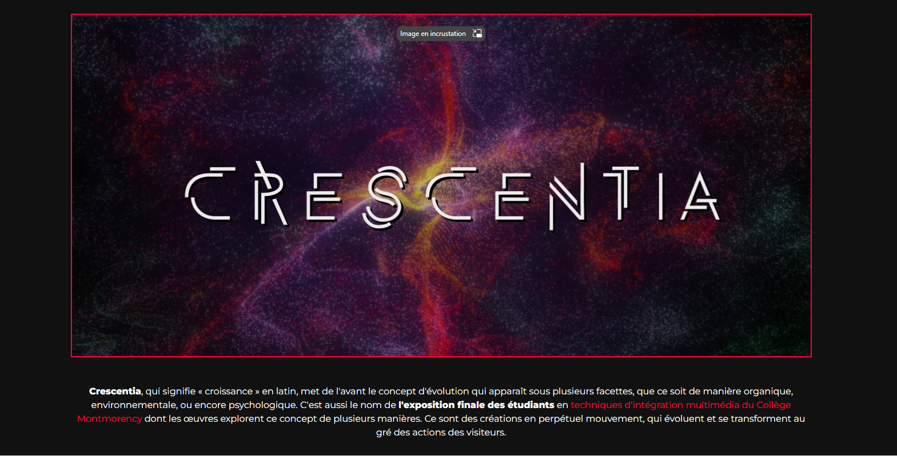

# Crescentia : Présentation et expérimentation d'une oeuvre interactive

**Source** : [Crescentia](https://tim-montmorency.com/2024/)

## Informations essentielles

- **Type d'exposition** : Intérieure
- **Date de visite** : Mercredi, le 20 mars 2024
- **Titre de l'oeuvre** : Crescentia                                                                                                                                                                                                                                                                                                                                                                          
- **Nom de l'artiste** : Étudiants de troisième année en Technique d'intégration multimédia
- **Année de réalisation** : 2024
- **Type d'installation** : Interactive                                                                                                  

## Description de l'exposition et son contenu
L'exposition *Crescentia* introduit le concept de l'évolution sur des plans variés, que ce soit psychologique ou environnemental, par l'intermédiaire de divers dispotifs interactifs.

**Pour la description originale, voir l'affiche plus haut.**

### Rhizomatique
L'oeuvre *Rhizomatique* met l'accent sur la notion du temps. C'est un dispositif interactif qui, par le biais d'une toile représentant le cerveau, permet à quiconque appuie sa main dessus de visionner ses propres souvenirs. De plus, la clarté des projections s'intensifie proportionnellement au contact avec le mécanisme. 

**Pour la description originale, consulter le lien ci-dessous.**
[Rhizomatique](https://tim-montmorency.com/2024/projets/Rhizomatique/docs/web/preproduction.html)

**Pour un aperçu visuel, consulter le lien ci-dessous.**

### Effet-Papillon
L'oeuvre *Effet-Papillon* présente le cycle vital d'un pommier à une fin éducative. On incite les interacteurs à manipuler les outils aux alentours de sorte qu'ils puissent non seulement enrichir leurs connaissances par rapport au développement de l'arbre et de la pomme depuis la semence mais, également, afin de découvrir le concept de l'Effet papillon. 

**Pour la description originale, consulter le lien ci-dessous.**
[Effet-Papillon](https://tim-montmorency.com/2024/projets/Effet-Papillon/docs/web/preproduction.html)

**Pour un aperçu visuel, consulter le lien ci-dessous.**

### Kigo
L'oeuvre *Kigo* est une expérience multimédia vécue sous forme de jeu vidéo encourageant l'activité du corps en entier. On baigne dans le thème des quatre périodes saisonnières, car l'environnement change dépendamment de la saison concernée. D'autres éléments tels que les effets sonores et l'ambiance sont équitablement modifiés. Le plan visuel à part, l'objectif principal du joueur est de récolter des points et éviter les obstacles sur son chemin en mesurant prudemment ses mouvements.

**Pour la description originale, consulter le lien ci-dessous.**
[Kigo](https://tim-montmorency.com/2024/projets/Kigo/docs/web/preproduction.html)

**Pour un aperçu visuel, consulter le lien ci-dessous.**

### Sonalux
L'oeuvre *Sonalux* est une expérimentation sonore accompagnée d'animations particulières qui repose totalement sur le contrôle de l'interacteur. Par l'intermédiaire de boutons et de codeurs rotatifs, il est possible de personnaliser l'audio et, conséquemment, la forme des animations.

**Pour la description originale, consulter le lien ci-dessous.**
[Sonalux](https://tim-montmorency.com/2024/projets/Sonalux/docs/web/preproduction.html)

**Pour un aperçu visuel, consulter le lien ci-dessous.**

### Canevas Cosmique
L'oeuvre *Canevas Cosmique* amène le sujet d'astronomie. L'audience est exposée à la projection d'un espace cosmique où le Soleil est le point focal. Ce dernier réagit différemment en fonction de la figurine qu'on positionne sur la table interactive, à l'endroit approprié.

**Pour la description originale, consulter le lien ci-dessous.**
[Canevas Cosmique](https://tim-montmorency.com/2024/projets/Canevas-Cosmique/docs/web/preproduction.html)

**Pour un aperçu visuel, consulter le lien ci-dessous.**

## Composantes et techniques

### Rhizomatique 

#### Audio
- Haut-parleurs actifs de 4"
- Fils XLR 3 Conducteurs de 15'
- Powercon

#### Vidéo
- Systèmes d'accrochage
- Kinects
- Câbles HDMI

#### Électricité
- Cordons IEC
- Extensions

#### Réseau
- Câbles Ethernet
- Received & Transmitted

#### Ordinateur
- Ordinateur portable

#### Logiciels
- TouchDesigner
- QIC +
- MadMapper
- VCV Rack 2
- DaVinci Resolve

Source : [Rhizomatique - Composantes](https://tim-montmorency.com/2024/projets/Rhizomatique/docs/web/preproduction.html)

### Effet-Papillon

#### Composantes (non-classifiées dans la source)
- Bouton Arduino
- Atom Poe
- Écran Raspberry Pi
- Valve à eau
- Rails de guidage linéaire
- Interrupteur
- Plaque interrupteur
- Ampoule LED
- Poulie
- Pomme en plastique
- Poids
- TOF
- Fairylight Adressable

#### Logiciels 
- QLC +
- TouchDesigner
- MadMapper
- Arduino
- HyperHDR
- FL Studio
- Visual Studio Code
- Blender
- Houdini
- SppedTree

Source : [Effet-Papillon - Composantes](https://onedrive.live.com/view.aspx?resid=99F7716F115888A9%21107&authkey=!ALh3auzN-XlN1XY)

### Kigo

#### Audio
- Console de sons
- Carte de sons
- Haut-parleurs Genelec 8010APM
- Câbles XLR M-F

#### Vidéo
- Projecteur
- Kinect V2
- Système d'accrochage

#### Électricité
- Cordons IEC
- Extensions de fils électriques
- Multiprises
- Câbles d'alimentation

#### Réseau
- Câbles Ethernet
- Extension HDMI
- Câbles HMDI
- Câble DisplayPort

#### Ordinateur
- Chariot d'ordinateur

#### Autres
- Tapis de protection
- Protections en métal
- Powercon
- Magic Arm

#### Logiciels
- TouchDesigner
- QIC +
- MadMapper
- VCV Rack 2
- DaVinci Resolve

Source : [Kigo - Composantes](https://tim-montmorency.com/2024/projets/Kigo/docs/web/preproduction.html)

### Sonalux

#### Audio
- Haut-parleurs actifs de 4"
- Fils XLR 3 Conducteurs de 15' M-F
- Interface audio USB composée de huit sorties et une entrée
- Casques d'écoute
- Carte de son

#### Vidéo
- Projecteurs vidéos Lentille Grand Angle 0.5

#### Lumière
- Tubes DEL
- Projecteur

#### Électricité
- Cordons IEC
- Extensions
- Fiches
- Conducteurs
- Multiprises

#### Réseau
- Fils Cat 6A de 15"
- Switch POE avec 5 ports

#### Ordinateur
- Ordinateur portable
- Ordinateur sur chariot

#### M5Stack
- Atom Lite
- Atom POE
- Angle Unit
- Key Unit
- ToF Unit
- PBHub
- GroveHub
- PaHub

#### Autres
- Podium
- Crochets

#### Logiciels
- TouchDesigner
- VCV Rack 
- Arduino IDE

Source : [Sonalux - Composantes](https://tim-montmorency.com/2024/projets/Sonalux/docs/web/preproduction.html)

### Canevas Cosmique

#### Audio
- Haut-parleurs
- Fils XLR 3 Conducteurs de 15' M-F
- Carte de son

#### Vidéo
- Projecteur vidéo Short Throw
- Projecteur vidéo Ultra-Short Throw
- Systèmes d'accrochage
- Kinect V2

#### Lumière
- Lumière DNX

#### Électricité
- Cordons IEC
- Multiprises

#### Réseau
- Switch POE avec 1 port
- Switch Ethernet avec 3 ports
- Câbles Ethernet
- Câbles HDMI
- Récepteurs & Émetteurs HDMI

#### Ordinateur
- Ordinateur portable
- Ordinateur branché

#### Logiciels
- TouchDesigner
- Unity 2022.3.8f1
- Autodesk Maya
- Blender
- Reaper

Source : [Canevas Cosmique - Composantes](https://tim-montmorency.com/2024/projets/Canevas-Cosmique/docs/web/index.html)

## Éléments nécessaires à la mise en exposition

### Rhizomatique
- Toile de spandex
- Structure en bois
- Cyclorama
- Grand studio

Source : [Rhizomatique - Mise en exposition](https://tim-montmorency.com/2024/projets/Rhizomatique/docs/web/preproduction.html)

### Effet Papillon
- Petit studio

Source : [Effet-Papillon - Mise en exposition](https://onedrive.live.com/view.aspx?resid=99F7716F115888A9%21107&authkey=!ALh3auzN-XlN1XY)

### Kigo
- Grand Studio
- Captation vidéo
- Projection vidéo sur un mur
- Installation de haut-paleurs
- Table
- Trépied

Source : [Kigo - Mise en exposition](https://tim-montmorency.com/2024/projets/Kigo/docs/web/preproduction.html)

### Sonalux
- Murs mobiles
- Grand studio

Source : [Sonalux - Mise en exposition](https://tim-montmorency.com/2024/projets/Sonalux/docs/web/preproduction.html)

### Canevas Cosmique
- Table 38"x26", 31" de hauteur (**Matériaux** : bois, acier, acrylique, spandex)
- Grand studio
- Statuettes imprimées en 3D
- Bloc-notes pour l'opération de la table

Source : [Canevas Cosmique - Mise en exposition](https://tim-montmorency.com/2024/projets/Canevas-Cosmique/docs/web/preproduction.html)

## Expérience vécue

### Rhizomatique
Tout visiteur qui souhaite interagir avec ce dispositif doit se positionner devant la toile et y appliquer une pression. Selon le degré de la force employée et la direction dans laquelle sa main se situe, les souvenirs, respectivement, apparaissent plus clairement et conformément à l'emplacement de la main. Je n'ai personnellement pas ressenti grand chose suite à ma propre expérimentation puisque les souvenirs ne provenaient pas de ma propre mémoire, mais le concept est très intéressant et pourrait même être thérapeutique car, avec la charge quotidienne, on devient souvent robotisé, et on tend à oublier les moments joyeux du passé. *Rhizomatique* permettrait  alors de les rallumer.

### Effet-Papillon
Afin de suivre la croissance du pommier, l'interacteur doit manipuler les divers boutons et leviers présents sur les lieux. Au centre, la structure est recouverte de petits écrans répartis de haut en bas, sur lesquels on peut constater l'évolution de l'arbre. En ce me concerne, le tout n'était pas vraiment à mon goût, peut-être parce que l'idée était trop ordinaire. L'Effet papillon est, certes, un phénomène intriguant, mais il aurait peut-être fallu utiliser quelque chose de plus visuellement impressionnant afin de générer des réactions.

### Kigo
Pour démarrer le jeu, le joueur doit s'avancer sur le tapis disposé devant l'écran. Ainsi, ce dernier va détecter le mouvement et enclencher la partie. On est invité à contrôler l'avatar par l'entremise de nos propres gestes de sorte à esquiver les obstacles et récolter le plus de points possible. Comme tout autre jeu, un manquement à l'égard des règles mène à la fin de la partie. *Kigo* est, à mon avis, l'un des meilleurs dispositifs, car il pousse les visiteurs à s'engager dans l'action et bouger (un point pour l'activité physique!). Pour ma part, c'était très divertissant, surtout en y participeant avec des amis.

### Sonalux
Ce dispositif sonore requiert qu'on personnalise l'audio et les animations sur les écrans en touchant aux paramètres sur le podium. Il faut d'abord s'approcher de ce dernier, car il est équipé d'un détecteur de mouvements qui active immédiatement l'oeuvre. Par la suite, il est possible de concevoir maintes variations de sons et d'animations avec les boutons installés devant le visiteur. J'ai apprécié cette expérience, principalement à cause de la liberté dont je disposais sur le plan créatif. Il était possible de produire plusieurs combinaisons de sons et d'effets visuels, aussi fascinant les uns des autres, artistiquement parlant.

### Canevas Cosmique
Le *Canevas Cosmique* présente une table sur laquelle on retrouve un écran interacitf qui est aussi exposé sur le mur d'en face. Il s'agit d'une illustration du système solaire avec laquelle on peut interagir en se servant des statuettes placées sur la table. Il suffit de les déposer sur l'écran afin de provoquer un phénomène cosmique. Additionnellement, on peut même les mettre directement sur le Soleil au centre afin de causer une réaction différente d'après la figurine utilisée. J'ai des sentiments partagés quant à cette oeuvre car, d'une part, j'ai aimé les effets spéciaux qui s'affichaient lorsqu'on jouait avec les sculptures 3D, mais ça devenait lassant après un moment.

## Points positifs
En général, chacun des dispositifs est bien réussi. Évidemment, des mises à jour seraient les bienvenues, mais le niveau d'interaction est acceptable et les idées introduites par les finissants sont en majorité captivantes. Par exemple, *Rhizomatique* permet de tisser un lien émotionnel avec l'audience. Sinon, *Kigo* ouvre une porte à la compétition et au plaisir. Ce ne sont pas des oeuvres qui se limitent à la contemplation (dans le cas échéant, ça aurait moins passionnant!).

## Aspects que je changerais
Je ne changerais pas grand chose car, tel que mentionné précédemment, on se situe plus près d'une réussite. Toutefois, des affiches explicatives et des guides seraient des solutions à considérer afin d'encadrer les visiteurs et de les aider à mieux comprendre les oeuvres qui les entourent, surtout *Effet-Papillon*, car on pouvait se perdre facilement avec tout le montage qu'il y avait autour. Il aurait probablement fallu installer des panneaux explicatifs pour que l'on puisse comprendre les conséquences de chaque manipulation.

## Références
