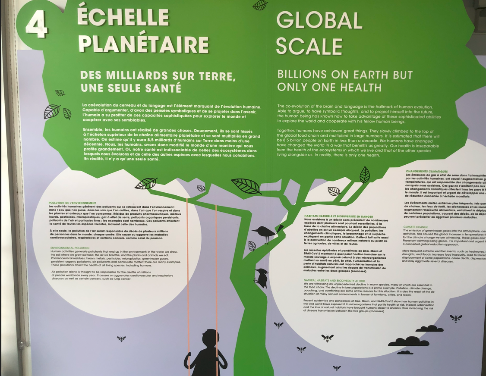
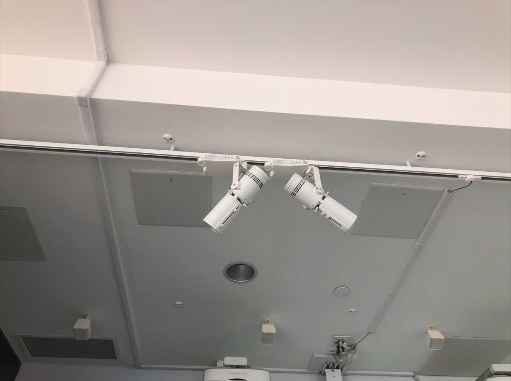
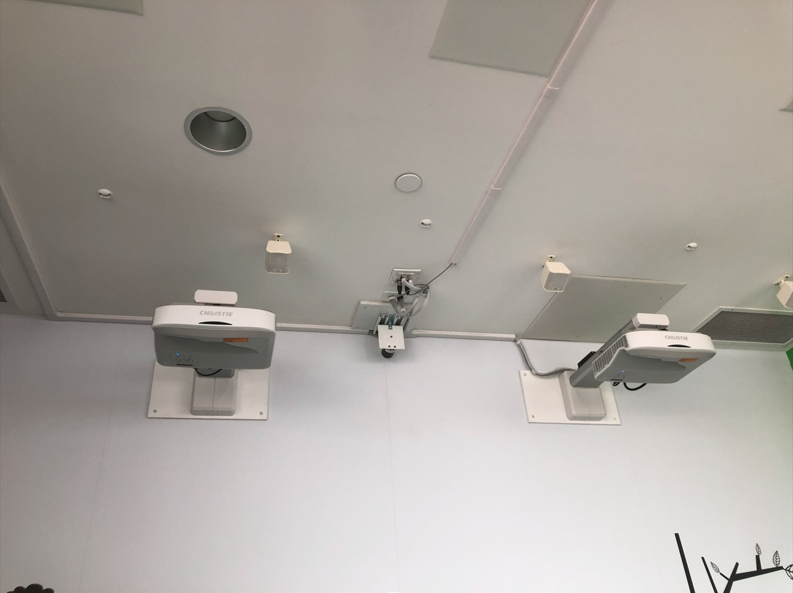

# 4,3,2,1... Santé : Présentation et expérimentation d'une oeuvre interactive

 

**Source** : [Musée de la Santé Armand-Frappier](https://museefrappier.org/exposition/4-3-2-1-sante/)

## Informations essentielles

- **Type d'exposition** : Intérieure
  
- **Date de visite** : Jeudi, le 7 mars 2024

  
- **Titre de l'oeuvre** : Échelle planétaire
                                                                                                 
- **Nom de l'artiste** : N/A
  
- **Année de réalisation** : N/A
  
- **Type d'installation** : Interactive

## Description de l'exposition et son contenu

*Échelle planétaire* est une projection éducative qui met l'accent sur la préservation de l'environnement planétaire et enseigne les marches à suivre pour remédier aux problèmes générés par des pratiques nuisibles devenues normalisées par la société.

Pour une description plus complète, voir l'image ci-dessous : 

 

## Composantes et techniques

- Boutons interactifs
- Animations
- Illustrations numériques
- Conception audio (sons de criquets)

## Éléments nécessaires à la mise en exposition

- Projecteurs vidéo
- Projecteurs ellipsoïdales
- Mur
- Microphones

 
 

## Expérience vécue

Les visiteurs sont incités à cliquer sur les boutons vibrants et à lire les explications projetées sur le mur afin de se renseigner sur le sujet de l'environnement. Il y a une vaste majorité d'information dont j'étais déjà au courant, donc je ne peux pas dire que j'étais étonné, mais c'est bon d'avoir un rappel à l'occasion, surtout avec la négligence notable de l'état planétaire (par exemple, les ordures que l'on trouve par terre dans tous les sens). 

Pour un aperçu visuel du dispositif, consulter le lien ci-dessous: 

[Échelle planétaire](https://cmontmorency365-my.sharepoint.com/:v:/g/personal/2148323_cmontmorency_qc_ca/ETi78KT2iEVGsnNqoFdW6z4B1PfGAQEpUrg-6HsjUVhiEQ?nav=eyJyZWZlcnJhbEluZm8iOnsicmVmZXJyYWxBcHAiOiJTdHJlYW1XZWJBcHAiLCJyZWZlcnJhbFZpZXciOiJTaGFyZURpYWxvZy1MaW5rIiwicmVmZXJyYWxBcHBQbGF0Zm9ybSI6IldlYiIsInJlZmVycmFsTW9kZSI6InZpZXcifX0%3D&e=0lCEFH)

## Points positifs

J'aime le fait qu'on utilise une approche technologique pour insister sur la protection de l'environnement étant donné qu'on se dirige vers un avenir branché. D'après ce que j'ai constaté sur mes réseaux sociaux, les manifestions tendent à frustrer les gens au lieu de les aider à comprendre, alors je trouve que l'emploi de moyens multimédias est une idée de génie, car c'est d'abord très efficace, mais également parce que les interacteurs peuvent en apprendre plus dans le confort.

## Aspects que je changerais

Je pense que la réalité virtuelle serait une méthode dont il faudrait tenir compte pour faire passer le message, car on aurait grandement plus de facilité à atteindre l'audience. Effectivement, les plonger dans un monde virtuel leur permettrait d'avoir une meilleure conception des complications environnementales puisque l'expérience serait vécue comme si elle prenait place dans la vraie vie.

## Références

- [Musée de la Santé Armand-Frappier](https://museefrappier.org/exposition/4-3-2-1-sante/)

