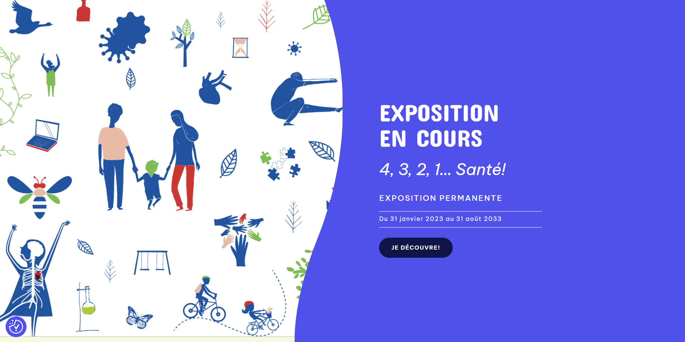
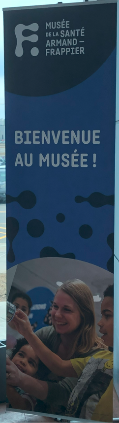
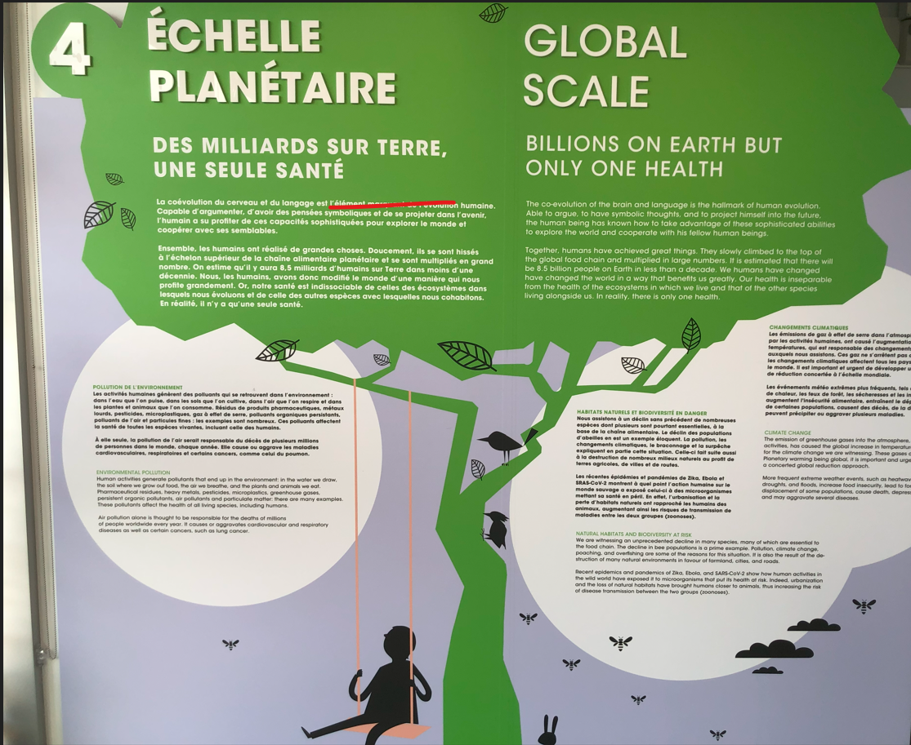

# 4,3,2,1... Santé : Présentation et expérimentation d'une oeuvre interactive

 

**Source** : [Musée de la Santé Armand-Frappier](https://museefrappier.org/exposition/4-3-2-1-sante/)

## Informations essentielles

- **Type d'exposition** : Intérieure
  
- **Date de visite** : Jeudi, le 7 mars 2024

  
- **Titre de l'oeuvre** : Échelle planétaire
                                                                                                 
- **Nom de l'artiste** : N/A
  
- **Année de réalisation** : N/A
  
- **Type d'installation** : Interactive

## Description de l'exposition et son contenu

*Échelle planétaire* est une projection éducative qui met l'accent sur la préservation de l'environnement planétaire et enseigne les marches à suivre pour remédier aux problèmes générés par des pratiques nuisibles devenues normalisées par la société.

Pour une description plus complète, voir l'image ci-dessous : 

 

## Composantes et techniques

## Éléments nécessaires à la mise en exposition
  

## Expérience vécue

## Points positifs

## Aspects que je changerais

## Références

