# Phase Shifting Index : Présentation et expérimentation d'une oeuvre immersive

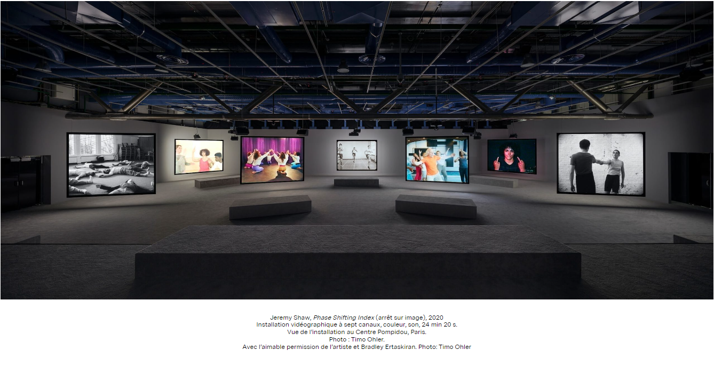

**Source** : [MAC](https://macm.org/expositions/jeremy-shaw/)

## Informations essentielles

- **Type d'exposition** : Intérieure
- **Date de visite** : Mercredi, le 31 janvier 2024
- **Titre de l'oeuvre** : Phase Shifting Index        
 
  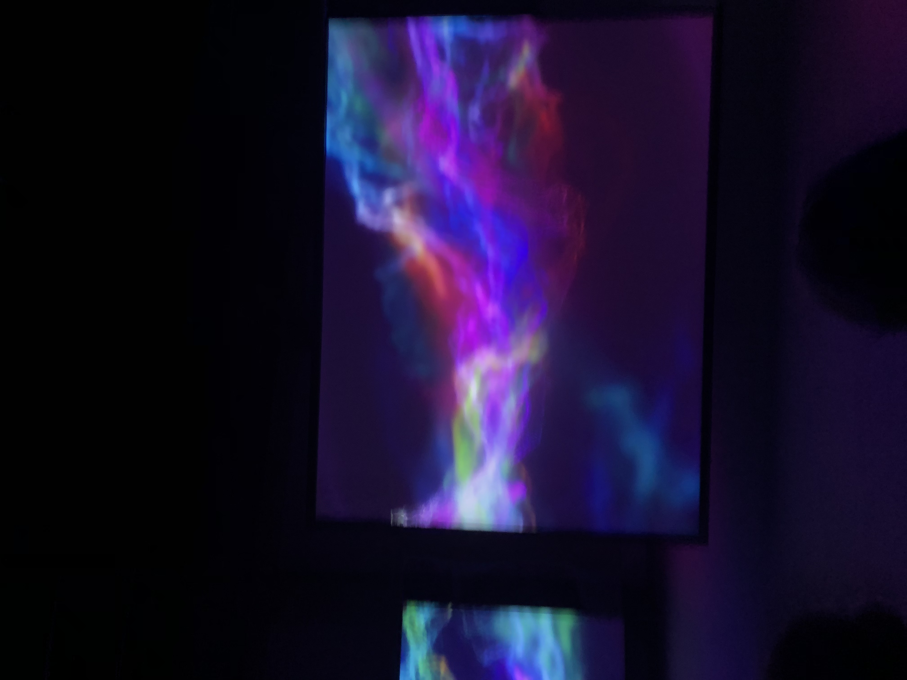
  
  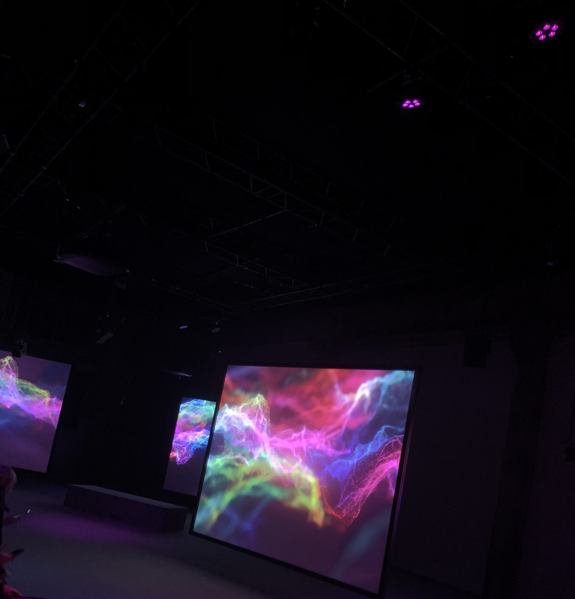
  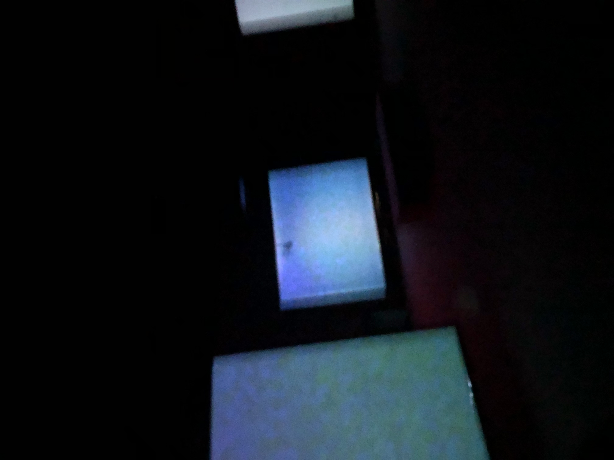
  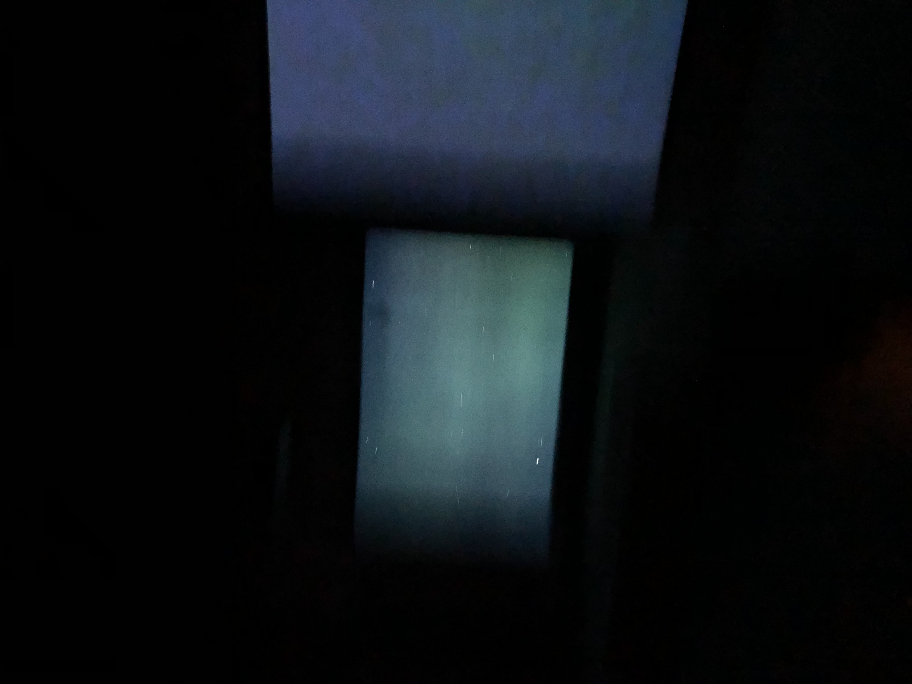
  
- **Nom de l'artiste** : Jeremy Shaw
- **Année de réalisation** : 2020
- **Type d'installation** : Immersive

[Aperçu](https://cmontmorency365-my.sharepoint.com/:v:/g/personal/2148323_cmontmorency_qc_ca/EQRJt1A14_tMowewXKqTqBEBXy-zxODl4y6-sZ1QTPBh0g?nav=eyJyZWZlcnJhbEluZm8iOnsicmVmZXJyYWxBcHAiOiJTdHJlYW1XZWJBcHAiLCJyZWZlcnJhbFZpZXciOiJTaGFyZURpYWxvZy1MaW5rIiwicmVmZXJyYWxBcHBQbGF0Zm9ybSI6IldlYiIsInJlZmVycmFsTW9kZSI6InZpZXcifX0%3D&e=3FCj1f)

## Description de l'exposition et son contenu

*Phase Shifting Index* est une expérience immersive dont le thème baigne dans un monde débranché de la réalité. Cette installation comprenant un ensemble de faux documentaires et d'autres éléments audiovisuels fidèles au style des années 60, invite son audience à faire la rencontre d'individus s'adonnant à ce qui paraissent être des activités physiques et thérapeutiques plutôt étranges, dont objectif se résume à l'exploration d'existences parallèles. On est alors introduit aux notions de transcendance et d'intemporalité par le biais du mouvement, tel que démontré par les maints groupes figurant sur les écrans. 

**Pour une description plus détaillée, procédez au lien suivant :** [MAC](https://macm.org/expositions/jeremy-shaw/)

### The Cyclical Culture

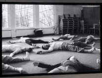

**Source** : [MAC](https://macm.org/expositions/jeremy-shaw/)

*The Cyclical Culture* est, sommairement, une expérience centrée sur la renaissance et la redécouverte du développement humain depuis la formation de l'embryon, dans le cadre d'une extinction humanitaire potentielle. Les membres traversent à nouveau les étapes de l'évolution individuelle, que ce soit au plan physiologique ou biologique, par l'intermédiaire des capacités humaines telles que le toucher, ou encore, la voix.

[Aperçu](https://cmontmorency365-my.sharepoint.com/:v:/g/personal/2148323_cmontmorency_qc_ca/EYYVf9ZbV5JIkx_mEViwcH0B2EalLrEUr0GUJ4UabhTIng?nav=eyJyZWZlcnJhbEluZm8iOnsicmVmZXJyYWxBcHAiOiJTdHJlYW1XZWJBcHAiLCJyZWZlcnJhbFZpZXciOiJTaGFyZURpYWxvZy1MaW5rIiwicmVmZXJyYWxBcHBQbGF0Zm9ybSI6IldlYiIsInJlZmVycmFsTW9kZSI6InZpZXcifX0%3D&e=rb04hx)

**Pour une description plus détaillée, se référer à l'image suivante :**

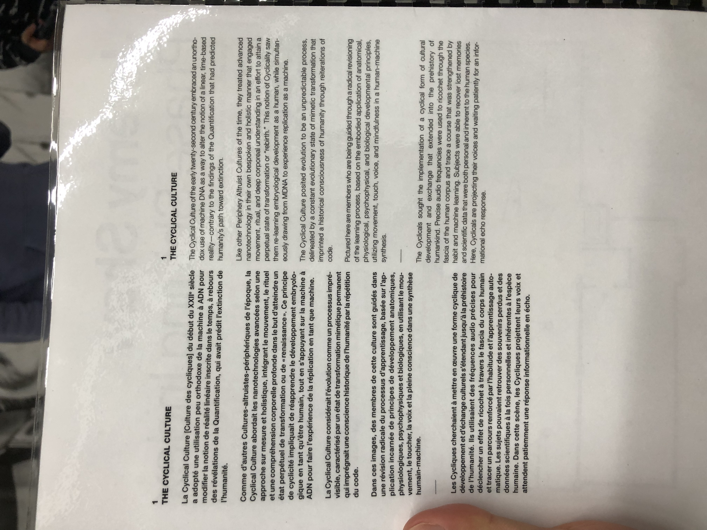

### Zero Ones

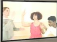

**Source** : [MAC](https://macm.org/expositions/jeremy-shaw/)

*Zero Ones* présente la recherche d'une harmonie entre l'être humain et la technologie. Les membres du groupe « Zero Ones » poursuivent, conséquemment, l'assimilation complète de leur race par la machinerie et un système informatique global. Ils répliquent, entre autres, des mouvements robotiques afin d'atteindre leurs idéaux, soit réunir l'individu et l'engin en un, précisément le surpassement de leur statut courant défini par un progrès évolutif.

(Aucun aperçu disponible)

**Pour une description plus détaillée, se référer à l'image suivante :**

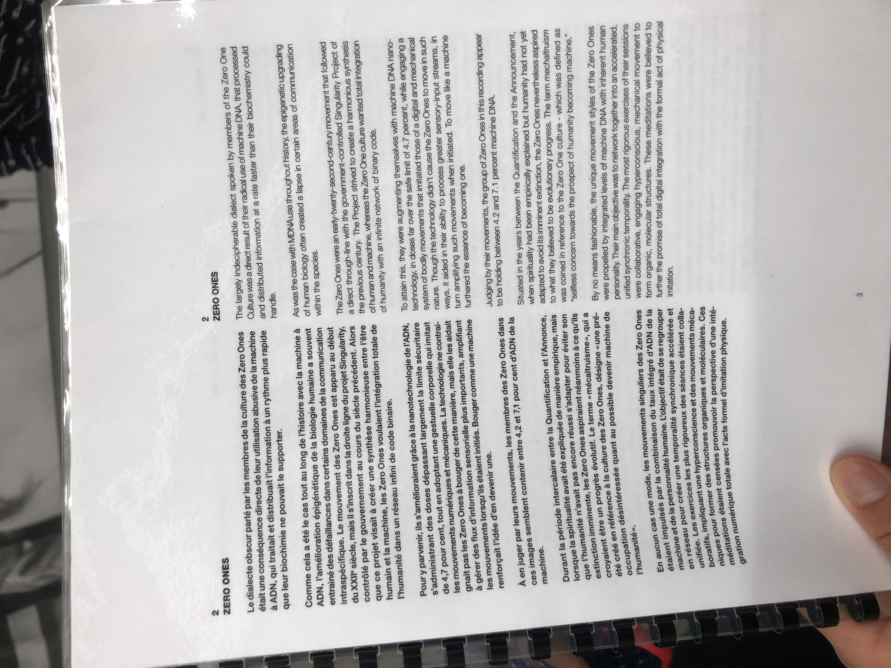

### The Violet Lux

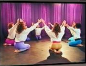

**Source** : [MAC](https://macm.org/expositions/jeremy-shaw/)

*The Violet Lux* introduit des concepts plutôt complexes, car les partisans de l'immatériel,  les « Violet Lux », auraient déjà gravit les échelons de la vie parallèle. Ils exécutent des gestes corporels ritualistes déjà programés afin d'éveiller ce qu'ils qualifient de « pure présence ». Autrement dit, leurs activités sont dirigées par le désir de transcender en mettant à l'épreuve leur dévotion envers la sublimité.

(Aucun aperçu disponible)

**Pour une description plus détaillée, se référer à l'image suivante :**

### The Alignment Movement

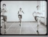

**Source** : [MAC](https://macm.org/expositions/jeremy-shaw/)

*The Alignment Movement* affiche une équipe de danseurs dictée par une chorégraphie parfaitement synchronisée. Les membres de ce petit assemblement cherchent à reconstituer des phénomènes scientifiques au moyen d'une méthode cinétique mathématiquement conçue, le but étant d'atténuer les séquelles d'une catastrophe humanitaire.

[Aperçu](https://cmontmorency365-my.sharepoint.com/:v:/g/personal/2148323_cmontmorency_qc_ca/EVVwc15qUmlPr6y8OZCP4vkBZr2sR01r-smX7QHtI0_hEQ?nav=eyJyZWZlcnJhbEluZm8iOnsicmVmZXJyYWxBcHAiOiJTdHJlYW1XZWJBcHAiLCJyZWZlcnJhbFZpZXciOiJTaGFyZURpYWxvZy1MaW5rIiwicmVmZXJyYWxBcHBQbGF0Zm9ybSI6IldlYiIsInJlZmVycmFsTW9kZSI6InZpZXcifX0%3D&e=kdpH9z)

**Pour une description plus détaillée, se référer à l'image suivante :**

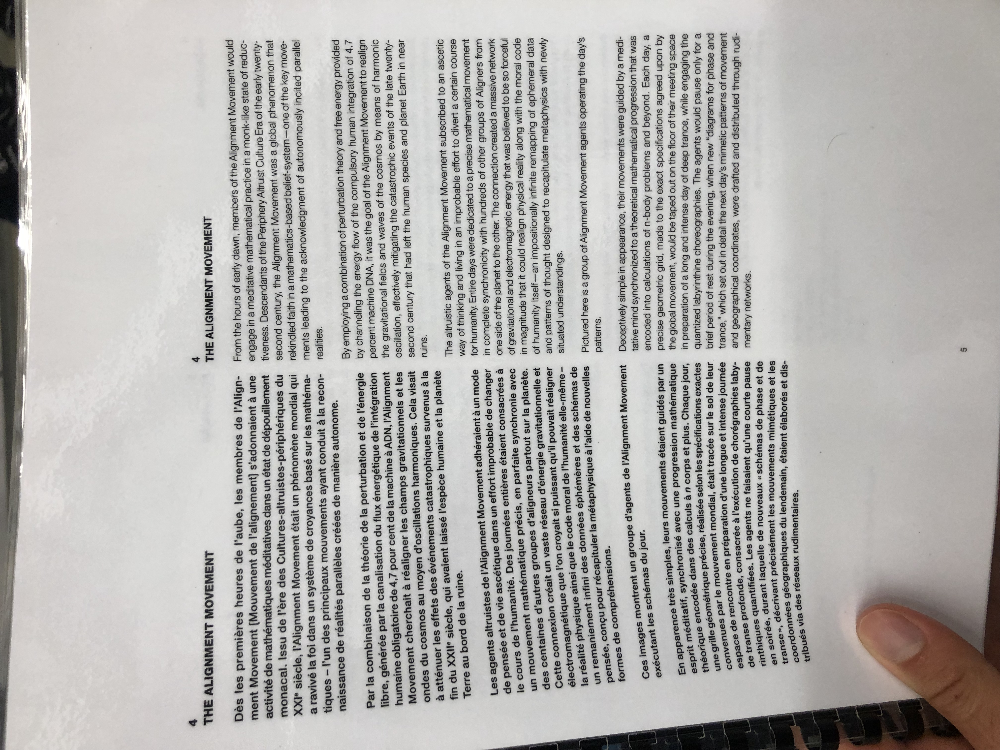

### Reclaimers

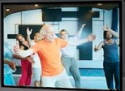

**Source** : [MAC](https://macm.org/expositions/jeremy-shaw/)

*Reclaimers* représente un regroupement qui, comparativement aux précédents, tente de retrouver son contact avec la réalité ordinaire. L'intégration importante de la numérisation et de la virtualité aurait provoqué une catastrophe technologique. Ainsi, les « Reclaimers », à l'aide d'exercices de coordination corporels, essaient de récupérer certaines fonctions longtemps perdues par la faute de l'alliance entre l'être humain et la machine.

[Aperçu - 1](https://cmontmorency365-my.sharepoint.com/:v:/g/personal/2148323_cmontmorency_qc_ca/EdT529qvhzNCudVvuxzlH7cBFY62VW75gXZFha8JxXJlPQ?nav=eyJyZWZlcnJhbEluZm8iOnsicmVmZXJyYWxBcHAiOiJTdHJlYW1XZWJBcHAiLCJyZWZlcnJhbFZpZXciOiJTaGFyZURpYWxvZy1MaW5rIiwicmVmZXJyYWxBcHBQbGF0Zm9ybSI6IldlYiIsInJlZmVycmFsTW9kZSI6InZpZXcifX0%3D&e=5CdwJg)

[Aperçu - 2](https://cmontmorency365-my.sharepoint.com/:v:/g/personal/2148323_cmontmorency_qc_ca/EeKF1c5wMqdEoiHsCbVY0TgB8kQpv5Y1_Nm5adzk4E_CpQ?nav=eyJyZWZlcnJhbEluZm8iOnsicmVmZXJyYWxBcHAiOiJTdHJlYW1XZWJBcHAiLCJyZWZlcnJhbFZpZXciOiJTaGFyZURpYWxvZy1MaW5rIiwicmVmZXJyYWxBcHBQbGF0Zm9ybSI6IldlYiIsInJlZmVycmFsTW9kZSI6InZpZXcifX0%3D&e=XN9mL6)

[Aperçu - 3](https://cmontmorency365-my.sharepoint.com/:v:/g/personal/2148323_cmontmorency_qc_ca/EeDpzs9lIPdFs7aSLDulXnYBJQFU2kTHfP7OoMNP9AFFsA?nav=eyJyZWZlcnJhbEluZm8iOnsicmVmZXJyYWxBcHAiOiJTdHJlYW1XZWJBcHAiLCJyZWZlcnJhbFZpZXciOiJTaGFyZURpYWxvZy1MaW5rIiwicmVmZXJyYWxBcHBQbGF0Zm9ybSI6IldlYiIsInJlZmVycmFsTW9kZSI6InZpZXcifX0%3D&e=0HCYaQ)

**Pour une description plus détaillée, se référer à l'image suivante :**

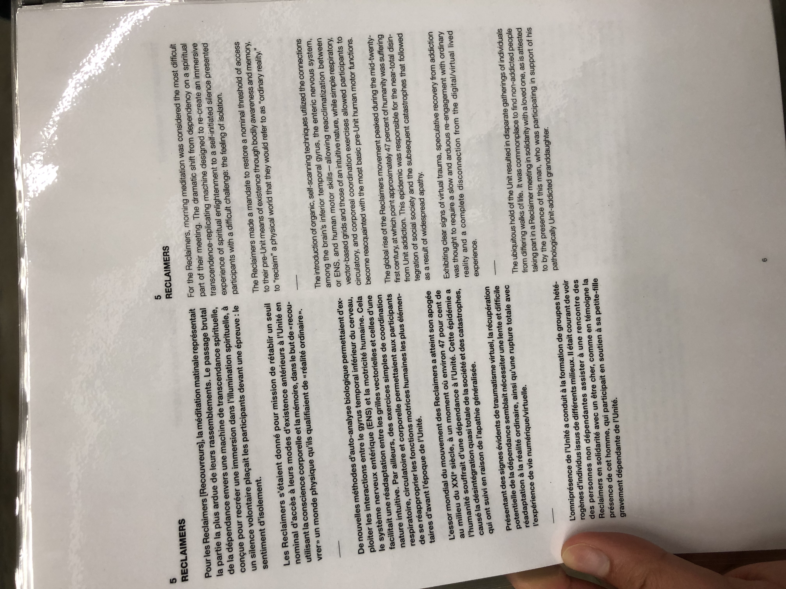

### Countdown

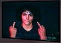

**Source** : [MAC](https://macm.org/expositions/jeremy-shaw/)

*Countdown* introduit un rassemblement de personnes à caractère assez barbare, considérant la manière dont ils se lancent dans tous les sens, sans omettre le langage vulgaire et la conduite semblable à celle de quelqu'un en état d'îvresse. Ils ne s'allient pas à la virtualité ni à leur ancienne vie, car ils croient plutôt au renouveau, un deuxième début sans l'imposition de règles sociétales. 

[Aperçu - 1](https://cmontmorency365-my.sharepoint.com/:v:/g/personal/2148323_cmontmorency_qc_ca/EXkdMioyv-tHgWz39ioosIEBjLfb2yynvZ1ZZiRUHzDDRg?nav=eyJyZWZlcnJhbEluZm8iOnsicmVmZXJyYWxBcHAiOiJTdHJlYW1XZWJBcHAiLCJyZWZlcnJhbFZpZXciOiJTaGFyZURpYWxvZy1MaW5rIiwicmVmZXJyYWxBcHBQbGF0Zm9ybSI6IldlYiIsInJlZmVycmFsTW9kZSI6InZpZXcifX0%3D&e=IKEuPc)

[Aperçu - 2](https://cmontmorency365-my.sharepoint.com/:v:/g/personal/2148323_cmontmorency_qc_ca/EeRNcoat4whMrfHnXoC6NHwBLzzcqInwSGgs9vDub6asgQ?nav=eyJyZWZlcnJhbEluZm8iOnsicmVmZXJyYWxBcHAiOiJTdHJlYW1XZWJBcHAiLCJyZWZlcnJhbFZpZXciOiJTaGFyZURpYWxvZy1MaW5rIiwicmVmZXJyYWxBcHBQbGF0Zm9ybSI6IldlYiIsInJlZmVycmFsTW9kZSI6InZpZXcifX0%3D&e=TLKyIs)

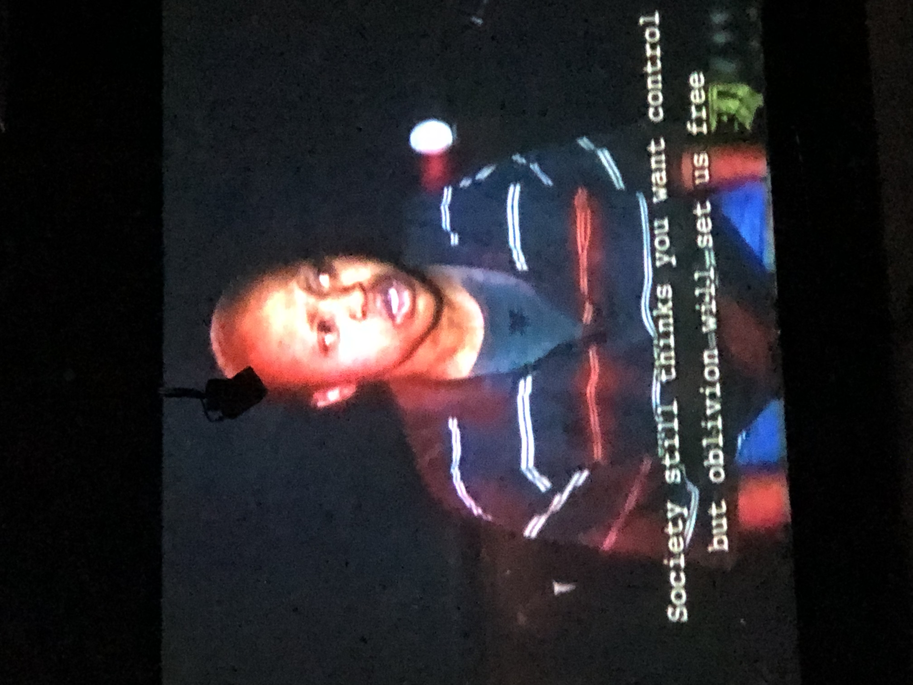

**Pour une description plus détaillée, se référer à l'image suivante :**

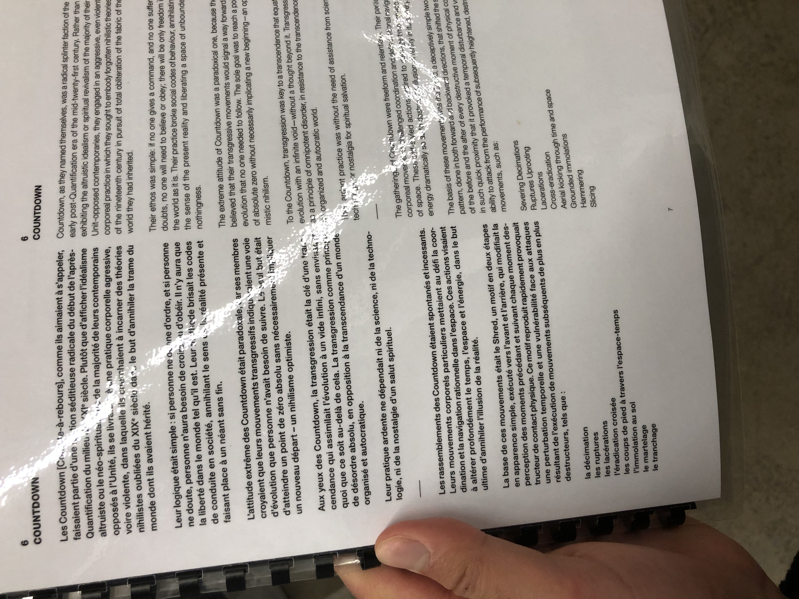

### Quantum Moderns

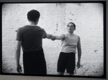

**Source** : [MAC](https://macm.org/expositions/jeremy-shaw/)

*Quantum Moderns* diffuse ce qui semble être une forme particulière de ballet. On nous présente deux accouplements d'individus qui réalisent des poses un peu spéciales. Par exemple, ils se superposent les uns sur les autres, ou encore, ils s'étirent les membres de façon inhabtiuelle. Leur objectif serait de modifier la nature physique et de manipuler le temps afin de garantir leur survie.

[Aperçu - 1](https://cmontmorency365-my.sharepoint.com/:v:/g/personal/2148323_cmontmorency_qc_ca/EcNP7vHwul1JsI3YziwUEogB9i1ub0y11DirwsaFdUckgw?nav=eyJyZWZlcnJhbEluZm8iOnsicmVmZXJyYWxBcHAiOiJTdHJlYW1XZWJBcHAiLCJyZWZlcnJhbFZpZXciOiJTaGFyZURpYWxvZy1MaW5rIiwicmVmZXJyYWxBcHBQbGF0Zm9ybSI6IldlYiIsInJlZmVycmFsTW9kZSI6InZpZXcifX0%3D&e=ZkGJi8)

[Aperçu - 2](https://cmontmorency365-my.sharepoint.com/:v:/g/personal/2148323_cmontmorency_qc_ca/EXuaTMZgb49DiiMdsdOD5ToBsHP7G20NZrXZDcNF6EJmWg?nav=eyJyZWZlcnJhbEluZm8iOnsicmVmZXJyYWxBcHAiOiJTdHJlYW1XZWJBcHAiLCJyZWZlcnJhbFZpZXciOiJTaGFyZURpYWxvZy1MaW5rIiwicmVmZXJyYWxBcHBQbGF0Zm9ybSI6IldlYiIsInJlZmVycmFsTW9kZSI6InZpZXcifX0%3D&e=diXBx4)

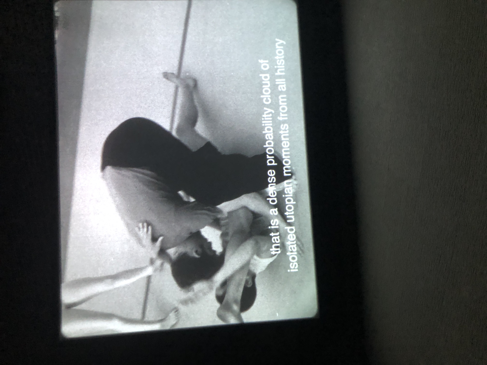

**Pour une description plus détaillée, se référer à l'image suivante :**

## Mise en espace

L'exposition est disposée dans une salle de forme rectangulaire, et les écrans, dans leur ensemble, occupent toute la largeur disponible, de manière à ce que les visiteurs puissent avoir une bonne vue de chaque contenu dès l'instant où ils pénètrent dans la pièce. Depuis l'extrémité gauche, on peut percevoir, en ordre, les présentations de *Cyclical Culture*, *Zero Ones* et *The Violet Lux*. *The Alignment Movement* est située au centre, puis elle est suivie par *Reclaimers*, *Countdown* et *Quantum Moderns*, respectivement, du côté droit de l'espace. 

**Schéma de l'exhibition** :

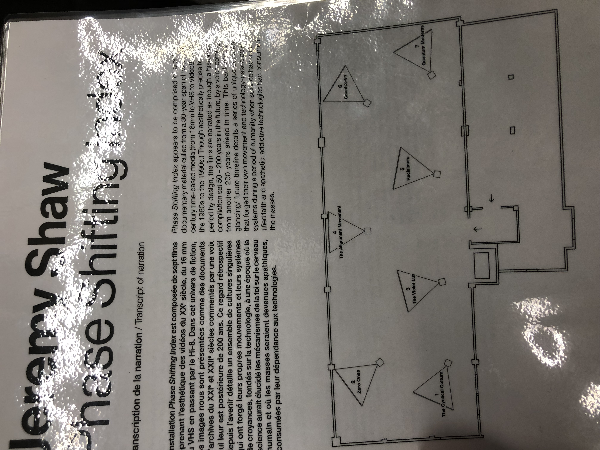
