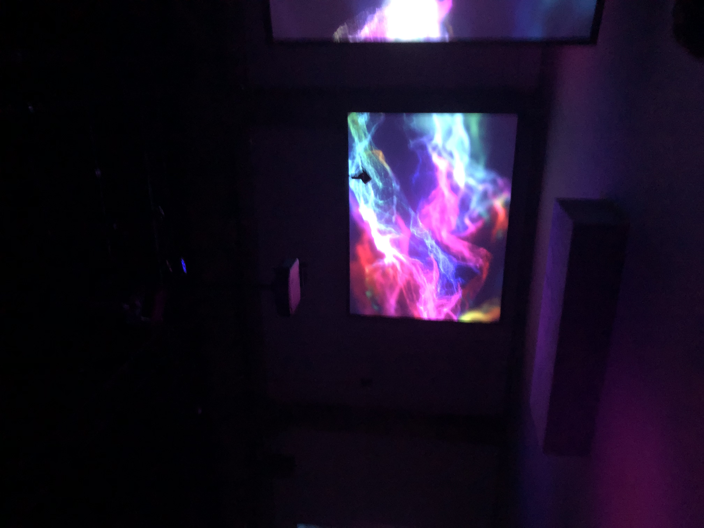

# Phase Shifting Index : Présentation et expérimentation d'une oeuvre immersive

**Source** : [MAC](https://macm.org/expositions/jeremy-shaw/)

## Informations essentielles

- **Type d'exposition** : Intérieure
- **Date de visite** : Mercredi, le 31 janvier 2024
- **Titre de l'oeuvre** : Phase Shifting Index        
 
  
  
  
  
  
  
- **Nom de l'artiste** : Jeremy Shaw
- **Année de réalisation** : 2020
- **Type d'installation** : Immersive

[Aperçu](https://cmontmorency365-my.sharepoint.com/:v:/g/personal/2148323_cmontmorency_qc_ca/EQRJt1A14_tMowewXKqTqBEBXy-zxODl4y6-sZ1QTPBh0g?e=kGdmmw&nav=eyJyZWZlcnJhbEluZm8iOnsicmVmZXJyYWxBcHAiOiJTdHJlYW1XZWJBcHAiLCJyZWZlcnJhbFZpZXciOiJTaGFyZURpYWxvZy1MaW5rIiwicmVmZXJyYWxBcHBQbGF0Zm9ybSI6IldlYiIsInJlZmVycmFsTW9kZSI6InZpZXcifX0%3D)

## Description de l'oeuvre

*Phase Shifting Index* est une expérience immersive dont le thème baigne dans un monde débranché de la réalité. Cette installation comprenant un ensemble de faux documentaires et d'autres éléments audiovisuels fidèles au style des années 60, invite son audience à faire la rencontre d'individus s'adonnant à ce qui paraissent être des activités physiques et thérapeutiques plutôt étranges, dont objectif se résume à l'exploration d'existences parallèles. On est alors introduit aux notions de transcendance et d'intemporalité par le biais du mouvement, tel que démontré par les maints groupes figurant sur les écrans. 

**Pour une description plus détaillée, suivre le lien suivant :** [MAC](https://macm.org/expositions/jeremy-shaw/)

### The Cyclical Culture
